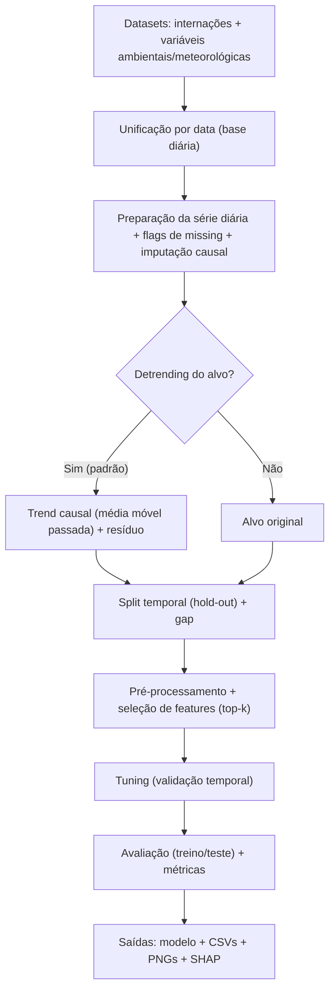

# QualiAr

**Título do TCC:** Modelagem Preditiva de Internações Respiratórias a partir de Poluentes Atmosféricos e Variáveis Meteorológicas  
**Alunos:** João Henrique dos Reis Terêncio; Bianca Gallicchio Tavares
**Semestre de Defesa:** 2025-2 (defesa em 19/12/2025)

[PDF do TCC]([./tcc.pdf](https://github.com/EIC-BCC/25_2-QualiAr/blob/main/Artigo/TCC.pdf)) 

# TL;DR

Para instalar e rodar (modo recomendado: salvar tudo em disco, sem abrir janelas de gráfico):

```bash
# 1) criar venv
python -m venv .venv

# 2) ativar venv
# Linux/macOS
source .venv/bin/activate
# Windows (PowerShell)
.\.venv\Scripts\Activate.ps1
# Windows (CMD)
.\.venv\Scripts\activate.bat

# 3) instalar dependências
pip install -r requirements.txt

# 4) executar
python Random_Forest.py --no-plots --output-dir random_forest_results
```

> Dica: para ver todas as opções disponíveis, rode `python Random_Forest.py -h`.

# Descrição Geral

Este repositório contém o código do TCC que investiga a previsão diária de internações por doenças respiratórias no município do Rio de Janeiro, integrando registros do SIH/SUS com variáveis de qualidade do ar e meteorologia em uma base diária unificada.

A pipeline realiza engenharia de atributos temporais, validação temporal (hold-out cronológico com *gap* entre treino e teste), treinamento e ajuste de hiperparâmetros de um modelo **Random Forest** e análise de interpretabilidade via **SHAP** (opcional). O objetivo é apoiar o planejamento e a gestão em saúde pública, avaliando como fatores autorregressivos, sazonais e ambientais se relacionam com a dinâmica das internações.


# Funcionalidades

* Treinamento e avaliação de Random Forest para previsão diária
  * Preparação da série diária (índice contínuo em frequência diária)
  * Tratamento de ausências em preditores (flags de *missing* + *forward-fill* limitado)
  * Divisão temporal treino/teste com *gap* para reduzir *leakage*
  * Busca de hiperparâmetros com validação temporal
* Opção de **detrending causal do alvo**
  * Treina no resíduo (alvo − tendência estimada usando apenas o passado)
  * Recompõe a tendência no momento da previsão para voltar à escala original
* Métricas e diagnósticos
  * MAE, RMSE, R², sMAPE, WMAPE e Bias
  * Gráficos “Real vs Previsto” (treino e teste)
  * Bias sazonal (mês do ano, no teste)
* Explicabilidade
  * Geração automática de gráficos SHAP (*beeswarm* e *bar*) quando o pacote `shap` está instalado
* Artefatos gerados em disco (por padrão em `random_forest_results/`)
  * `rf_model.joblib`
  * `predictions.csv`
  * `monthly_bias_moy_test.csv` e `monthly_bias_moy_test.png`
  * `real_vs_previsto_train.png` e `real_vs_previsto_test.png`
  * `shap_summary_beeswarm.png` e `shap_summary_bar.png` 

# Arquitetura




# Dependências

* **Python 3.10+** (recomendado)
* Instalação via `requirements.txt` (ambiente reprodutível com versões fixadas)

<details>
<summary><strong>Lista completa (requirements.txt)</strong></summary>

```txt
absl-py==2.3.1
altair==5.5.0
asttokens==3.0.0
astunparse==1.6.3
attrs==25.3.0
blinker==1.9.0
cachetools==6.1.0
certifi==2025.8.3
charset-normalizer==3.4.2
click==8.2.1
cloudpickle==3.1.1
colorama==0.4.6
comm==0.2.3
contourpy==1.3.3
cycler==0.12.1
debugpy==1.8.16
decorator==5.2.1
executing==2.2.0
filelock==3.19.1
flatbuffers==25.2.10
fonttools==4.59.0
fsspec==2025.7.0
gast==0.6.0
gitdb==4.0.12
GitPython==3.1.45
google-pasta==0.2.0
grpcio==1.74.0
h5py==3.14.0
idna==3.10
ipykernel==6.30.1
ipython==9.4.0
ipython_pygments_lexers==1.1.1
jedi==0.19.2
Jinja2==3.1.6
joblib==1.5.1
jsonschema==4.25.1
jsonschema-specifications==2025.4.1
jupyter_client==8.6.3
jupyter_core==5.8.1
keras==3.11.2
kiwisolver==1.4.9
libclang==18.1.1
llvmlite==0.45.0
Markdown==3.8.2
markdown-it-py==4.0.0
MarkupSafe==3.0.2
matplotlib==3.10.5
matplotlib-inline==0.1.7
mdurl==0.1.2
ml_dtypes==0.5.3
mpmath==1.3.0
namex==0.1.0
narwhals==2.1.2
nest-asyncio==1.6.0
networkx==3.5
numba==0.62.0
numpy==2.3.2
opt_einsum==3.4.0
optree==0.17.0
packaging==25.0
pandas==2.3.1
parso==0.8.4
patsy==1.0.1
pillow==11.3.0
platformdirs==4.3.8
plotly==6.3.0
prompt_toolkit==3.0.51
protobuf==6.32.0
psutil==7.0.0
pure_eval==0.2.3
pyarrow==21.0.0
pydeck==0.9.1
Pygments==2.19.2
pyparsing==3.2.3
python-dateutil==2.9.0.post0
pytz==2025.2
pywin32==311
pyzmq==27.0.1
referencing==0.36.2
requests==2.32.4
rich==14.1.0
rpds-py==0.27.0
scikit-learn==1.7.1
scipy==1.16.1
seaborn==0.13.2
setuptools==80.9.0
shap==0.48.0
six==1.17.0
slicer==0.0.8
smmap==5.0.2
stack-data==0.6.3
statsmodels==0.14.5
streamlit==1.48.1
sympy==1.14.0
tenacity==9.1.2
tensorboard==2.20.0
tensorboard-data-server==0.7.2
tensorflow==2.20.0
termcolor==3.1.0
threadpoolctl==3.6.0
toml==0.10.2
torch==2.8.0
tornado==6.5.1
tqdm==4.67.1
traitlets==5.14.3
typing_extensions==4.14.1
tzdata==2025.2
Unidecode==1.4.0
urllib3==2.5.0
watchdog==6.0.0
wcwidth==0.2.13
Werkzeug==3.1.3
wheel==0.45.1
wrapt==1.17.3
xgboost==3.0.4
```

</details>

# Execução

## 1) Preparar ambiente (venv)

```bash
python -m venv .venv

# Linux/macOS
source .venv/bin/activate

# Windows (PowerShell)
.\.venv\Scripts\Activate.ps1
```

## 2) Instalar dependências

```bash
pip install -r requirements.txt
```

## 3) Rodar a pipeline

Execução padrão (com detrending e gráficos):

```bash
python Random_Forest.py
```

Sem abrir janelas de gráficos (modo *headless*, recomendado em servidor/CI):

```bash
python Random_Forest.py --no-plots
```

Sem detrending:

```bash
python Random_Forest.py --no-detrend
```

Recorte temporal:

```bash
python Random_Forest.py --start 2014-01-01 --end 2024-12-31
```

Ajuste de parâmetros principais:

```bash
python Random_Forest.py --k-features 30 --gap-days 7 --window-size 14 --test-size 0.2
```

Salvar resultados em outra pasta:

```bash
python Random_Forest.py --output-dir resultados_rf_novos
```


## 4) Onde ficam os resultados?

Por padrão, tudo é salvo em:

- `random_forest_results/`

Inclui modelo (`rf_model.joblib`), predições (`predictions.csv`), métricas (impressas no terminal), gráficos (PNG) e SHAP.

